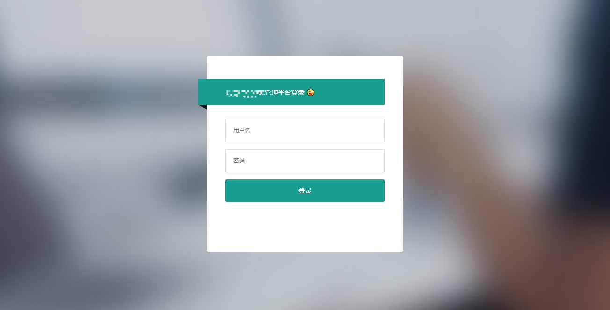
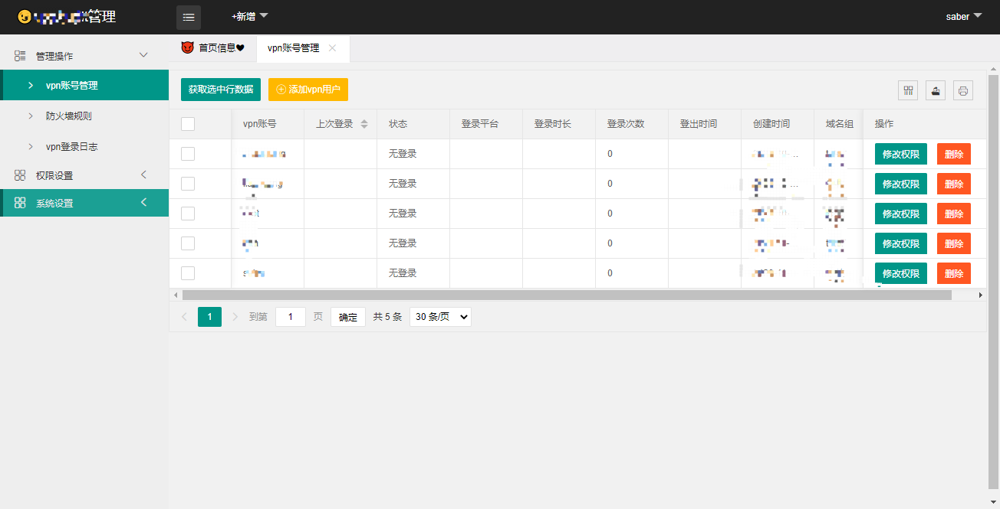
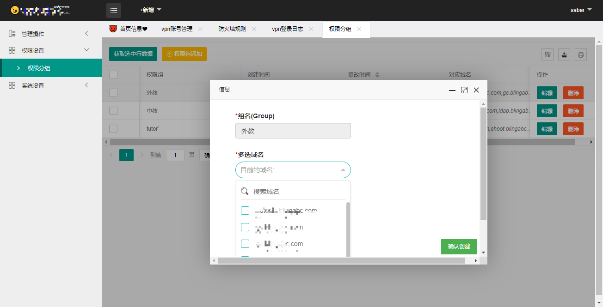

# openvpn-system


**对openvpn的一套增删改查系统,并且根据自建rbac权限组,对vpn账号做权限管理控制（防火墙规则）**


#### 前端
```
x-admin
layerui
bootstrap 
jquery
ajax
xm-select 
```


#### 后端
```
gin
go
gorm
mysql
github.com/hpcloud/tail
select 管道
goroutine
```


### 架构

*前端负责*

>、创建本平台的账号
   、创建权限组
   、对账号的增删改查等
   、平台本身的操作记录
   、定时获取阿里云的域名，添加到domains表中
   
   、openvpn与权限组绑定，权限组与domains表的域名绑定
   、创建openvpn的账号,并添加到openvpn配置文件,若是账号密码的形式，则重启openvpn，若是秘钥的形式，则无需重启


*后端负责*

>、通过tail获取最新的openvpn登录账号,扔到管道处理
   、把所有账号放到内存，openvpn记录账号的文件实时读取，若是账号下线，则执行对应的防火墙规则即可
   、通过数据库中账号的权限组获取对应的域名,添加对应防火墙规则（IPtables）ps:像是kubernetes的ipvs那种目前还没做，因为人不多，所以就添加到防火墙了

   

### 登录


### 登录错误


### 账号操作界面


### 域名操作

